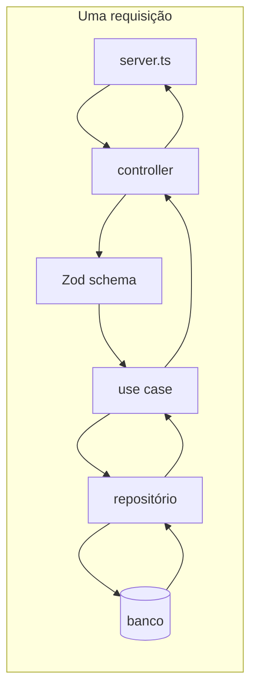

# Fluxo do back-end: da requisição HTTP ao banco

Objetivo desta anotação: registrar **como o sistema organiza o trabalho** (quais arquivos entram em cena) e em **que ordem** isso acontece — do ponto de vista de uma requisição **de fora para dentro** e da resposta **de dentro para fora**.

> **Duas “linhas do tempo”**  
> - **Na subida do servidor:** o `container` monta repositórios e *use cases*; o `server` registra rotas que já recebem essas instâncias (ou um *factory*).  
> - **Em cada requisição HTTP:** rota → *controller* → validação → *use case* → *repositório* → banco → retorno pelo mesmo caminho (com *mappers* onde fizer sentido).



---

## 1. `infra/server.ts` — aplicação HTTP e rotas

**Importa (exemplos):**

- Fastify  
- Configurações (CORS, plugins, etc.)  
- *Controllers* (ex.: `astronautController` de `infra/controllers/…`)

**Responsabilidade:**

- Criar a instância do Fastify, aplicar configurações e **registrar as rotas** de cada *controller* (cada entidade costuma ter um *controller* correspondente).

---

## 2. `infra/controllers/entidadeController.ts` — borda HTTP (entrada e saída)

**Utiliza:**

- `FastifyInstance` (Fastify)  
- *Schemas* Zod (`infra/schemas/entidade.schema.ts`)  
- *Use cases* já prontos, vindos do `infra/di/container.ts`

**Responsabilidade:**

- **Amarrar método HTTP + URL** ao comportamento desejado (`GET`, `POST`, etc.).  
- Em cada *handler*: extrair `body` / `query` / `params` → **validar** com Zod (se o formato estiver errado, o Zod falha e você trata o erro antes da regra de negócio) → chamar **`await entidadeUseCase.execute(dadosValidados)`** → opcionalmente **mapear** o resultado para o formato da API → `reply.status(...).send(...)`.

**Exemplo (ideia geral):**

```ts
app.post("/endpoint", async (request, reply) => {
  const dados = entidadeSchema.parse(request.body);
  const resultado = await entidadeUseCase.execute(dados);
  // opcional: mapper de domínio/DTO → resposta HTTP
  return reply.status(201).send(resultado);
});
```

> O *controller* fala **HTTP**; o *use case* não deve depender de `request`/`reply`.

---

### 2.1 `infra/schemas/entidade.schema.ts` — contrato da entrada

**Utiliza:** Zod.

**Responsabilidade:**

- Descrever o formato esperado de *body*, *query* e *params*.  
- Exportar tipos inferidos (`z.infer<typeof schema>`), alinhados ao que o *use case* ou o DTO esperam.

---

### 2.2 `infra/mappers/entidadeMapper.ts` — troca de “formatos”

**Utiliza:**

- Tipos do domínio (entidade) e, quando existir, o formato “linha do banco” (*row*).

**Responsabilidade:**

- Classe (ou funções) com papéis típicos:  
  - **`toDomain`**: linha retornada pelo BD → objeto no modelo do domínio.  
  - **`toPersistence`**: entidade (ou DTO de persistência) → colunas / objeto que o driver ou a query esperam.

> *Mappers* aparecem no **repositório** (BD ↔ domínio) e, se quiser, no **controller** (domínio/DTO ↔ JSON da API).

---

## 3. `infra/di/container.ts` — montagem das dependências (principalmente na subida)

**Importa:**

- Implementação do repositório (ex.: `PostgresAstronautRepository`)  
- *Use cases* (ex.: `CreateAstronautUseCase`)

**Responsabilidade:**

- **Instanciar** o repositório concreto.  
- **Instanciar** cada *use case* **injetando** a interface do repositório que o domínio define (a implementação concreta é a do Postgres, etc.).

```ts
const postgresAstronautRepository = new PostgresAstronautRepository();
export const createAstronautUseCase = new CreateAstronautUseCase(
  postgresAstronautRepository
);
```

> Na **requisição**, o fluxo não “passa pelo container”: o container já deixou o *use case* pronto para o *controller* usar.

---

## 4. `app/useCases/FuncaoEntidadeUseCase.ts` — regra de negócio / orquestração

**Importa:**

- Entidades / tipos do `domain`  
- **Interface** do repositório (`domain/repositories/…`), não o Postgres em si  
- Classe base ou contrato de *use case* (ex.: `domain/value-objects/UseCase.ts`)  
- DTO de entrada da operação

**Responsabilidade:**

- Implementar `execute` (ou equivalente): receber o DTO, aplicar regras, chamar **`entidadeRepository.salvarOuBuscar(...)`** conforme a interface.  
- Retornar entidade, DTO de saída ou resultado da operação — **sem** saber se os dados vêm de Postgres, arquivo ou API externa.

> **Ordem na requisição:** depois do *controller* e **antes** do repositório concreto.

---

## 5. `infra/repositories/PostgresEntidadeRepository.ts` — acesso a dados

**Importa:**

- Pool ou cliente (`infra/database/client.ts`)  
- Tipos de linha (`infra/database/types.ts`), se existirem  
- Interface do repositório definida no **domínio**

**Responsabilidade:**

- **Implementar** a interface do repositório do domínio (`domain/repositories/entidadeRepository.ts`).  
- Executar **SQL** (ou ORM), receber linhas, usar **`toDomain`** / **`toPersistence`** quando necessário.  
- Retornar tipos que o *use case* espera (muitas vezes entidade ou estrutura já mapeada).

> Aqui **não** se definem “métodos HTTP”. HTTP é só na camada do Fastify/*controller*. O repositório expõe operações de **dados** (`create`, `findById`, etc.).

---

## 6. `domain/entities/Entidade.ts` — modelo do negócio (referência transversal)

**Importa:** por exemplo, classe base `Entity` em `domain/value-objects/Entity.ts`.

**Responsabilidade:**

- Definir **props** da entidade e a **classe** que representa o conceito de negócio, estendendo `Entity` quando fizer sentido.

---

## Resumo rápido

| Momento        | Ordem sugerida para pensar na requisição                         |
|----------------|------------------------------------------------------------------|
| Subida do app  | `container` → *use cases* com repositórios → `server` registra rotas |
| Cada HTTP      | `server` → *controller* → Zod → *use case* → *repositório* → BD → volta |

